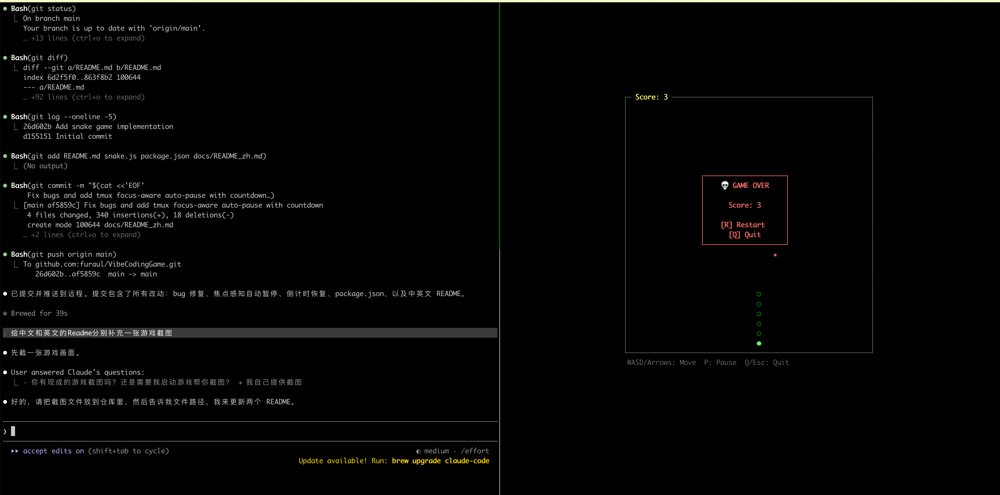

# VibeCodingGame

[English](../README.md)

Vibe Coding 的时候，等 AI 响应太无聊？来一局贪吃蛇。

这是一个终端贪吃蛇游戏，专为 tmux 分屏 + Claude Code 的工作流设计。在一个 pane 里跑 Claude Code，另一个 pane 里玩蛇，切换 pane 时游戏自动暂停，切回来有 3 秒倒计时让你准备好再继续。



## 快速开始

### 1. 安装 tmux（如果还没有）

```bash
# macOS
brew install tmux

# Ubuntu/Debian
sudo apt install tmux
```

### 2. 配置 tmux

在 `~/.tmux.conf` 中添加：

```
set -g mouse on
set -g focus-events on
```

然后重新加载：

```bash
tmux source-file ~/.tmux.conf
```

`mouse on` 让你可以点击切换 pane，`focus-events on` 让游戏能感知焦点变化自动暂停/恢复。

### 3. 启动

一行命令搞定：

```bash
tmux new-session -d 'claude' \; split-window -h 'node snake.js' \; attach
```

或者手动操作：

```bash
tmux                  # 启动 tmux
# Ctrl+B 然后 %      # 左右分屏
claude                # 左边启动 Claude Code
# 鼠标点击右边 pane
node snake.js         # 启动游戏
```

## 操作

| 按键 | 功能 |
|------|------|
| WASD / 方向键 | 移动 |
| P | 暂停 |
| Q / Esc | 退出 |
| R | 重新开始（Game Over 时） |
| Ctrl+Z | 挂起游戏（`fg` 恢复） |

## 特性

- **焦点感知**：切到其他 tmux pane 时自动暂停，切回来 3 秒倒计时后恢复
- **自适应终端大小**：游戏区域自动适配终端尺寸，缩放窗口也没问题
- **零依赖**：只需要 Node.js，没有任何 npm 依赖

## 要求

- Node.js >= 14
- tmux（推荐，用于分屏和焦点感知）
